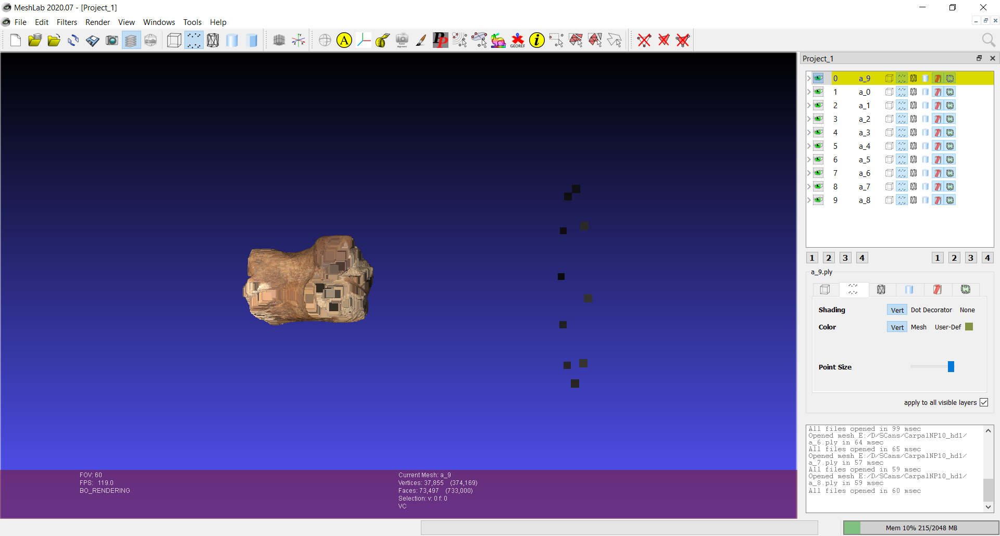
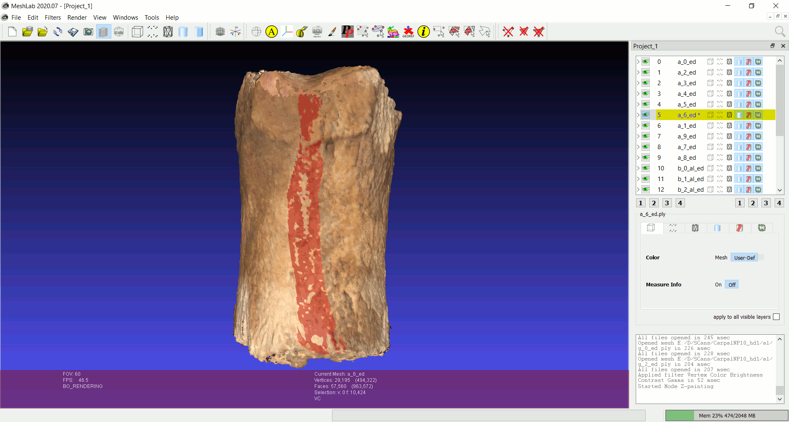

# Processing Scans in Open-Source Software 
**by Terrie Simmons-Ehrhardt**

This tutorial describes options for processing 3D scans into meshes using Meshlab. There is a [set of videos](https://www.youtube.com/playlist?list=PL53FAE3EB5734126E) on YouTube demonstrating the 3D Scanning Pipeline in Meshlab. While I specifically discuss NextEngine scans in this tutorial, you can process scans from any scanner in Meshlab as long as you can export one of the common 3D file formats such as `PLY`.

## Why use Meshlab? 
- It's faster at calculating your mesh and blending the colors (if needed).
- You're not restricted to the scan families--you can attach and combine any single scans to create your own groups.
- Sometimes auto-alignment of 360 scans or alignment of scan families just doesn't work (especially with thin objects).
- In general, Meshlab offers more flexiblity in processing to produce your final mesh.

Exporting scans from ScanStudio for Meshlab editing can occur at any stage of the editing process.
- Edit scan families in ScanStudio --> export `PLYs` to Meshlab.
- Edit scans and align in ScanStudio --> export `PLYs` to Meshlab. (Aligned scans will retain their alignment in Meshlab.)
- Edit scans, align, fuse scan families in ScanStudio --> export fused `PLY` to Meshlab. *Note that although there is an option to "Create Watertight" mesh under Fuse--the mesh will appear watertight but may not actually be watertight.*

## Editing in ScanStudio
Before exporting from ScanStudio, scans can be edited and even aligned. Whether you edit and/or align before exporting is simply a matter of preference--the editing tools in ScanStudio are user friendly and aligning before export can help with visualizing overlapping or redundant data while working in Meshlab. 

The figures below show the detachment of scans within an individual family (double-click on the thumbnail of a family to see the individual scans in a 360 scan). Drag scans out of the green areas to "detach" for finer editing. Simply drag them back to the green area to "reattach." This can be helpful to edit the edges of individual scans which tend to have distorted color.

  

If color capture and alignment produce a nice looking scan, you can also proceed to the **Fuse** step. I usually try **Mesh Reconstruction**, but you can also try **Volume Merge** to see which gives you a better mesh. Although **Fuse** is slow, it's worth trying if you need color--if the color actually looks good, you can also export this fused model to Meshlab for finishing.

## Exporting from ScanStudio

- **To export a scan family as one file**, drag the family you want to export into the green box and select it (white halo around it). Go to `File --> Save As`, check `Save as Single File`, enter a file name and select `PLY` under file type. 
- **To export individual scans**, drag the family you want to export into the green box and select it (white halo around it), *un-check* `Save as Single File`, enter a file name and select `PLY` for file type--the separated scans will automatically get a number added on to the file name depending on the number of divisions you used (8 divisions = files 0 to 7). 
  - If you have aligned multiple families, you can export each family separately (by detaching them and only having one family in the green) or export all at once (all aligned families in the green) and you will see all files dropped into the designated folder (numbered 0 to total number of divisions for all families).
- **To export a fused model**, drag the fused model into the green area by itself and select it, check `Save as Single File`, and select `PLY` or `OBJ` under file type. A `PLY` will have colored saved per vertex, while an `OBJ` will have color saved as texture files.
  - If you export a `PLY`, you can use it to generate a Poisson mesh reconstruction as described further down in this tutorial.

In the figures below, I exported one family at a time and named the files by family--see that for each family, I un-checked `Save as a Single File`, so the file names are numbered by the number of divisions--**a** had 10 divisions (0 to 9), **b**, **c**, **f**, and **g** were bracket scans to capture the proximal and distal ends of the bone. 

If I had aligned these and had them all "attached" in the green upon export, they would have been numbered 0 to 22.

 

## Editing in Meshlab
In Meshlab, the workflow is similar to what it would be in ScanStudio: editing, aligning, more editing if needed (for color), and producing a watertight mesh. For this tutorial, I have a 360 scan of a bone (with 10 divisions), plus 4 sets of brackets of the ends. The 360 will serve as my primary set of scans to which I will align the ends.

The amount of editing depends primarily on whether or not you need color. Any individual scans that have distorted color (dark shadows, bright spots) can contribute to the final model color, so editing these areas out throughout the alignment process will give you the best color representation in your final model.

- `PLYs` can be dragged and dropped into the Meshlab window--either all scans or scans from one family. 
- The very first thing you'll notice is that the scans from one family are still aligned to each other and that they are off-center. That's because there are alignment dots out in space from ScanStudio (I don't know how to get rid of these before exporting from ScanStudio). 
- To visualize the dots, hold `Shift` and click the vertices representation  next to a file name in the layer dialog or on the main toolbar to select it  and then also click the solid mesh representation  to de-select it. This will convert from face representation to vertices only so you can see the alignment dots. Adjust the size of the vertices so you can see them better. 

 

- Click on the `Select Vertices` button on the main toolbar , draw a rectangle around the vertices, then click the `Delete Vertices` button . Do this for each layer and export as new `PLYs`.
  - You don't have to find the "one vertex" that belongs to each layer. Just draw the rectangle around them all and the one that gets selected in red belongs to the layer that you currently have selected in the layer dialog (highlighted yellow).

 

### Paintbrush Editing
Meshlab has rectangle editing tools as demonstrated in the above figures, but there is also a paintbrush editing tool which functions similarly to the ScanStudio editing tool--by allowing you to paint the areas you want to delete. The paintbrush size can also be adjusted.

Since I have a 360 scan that will serve as the base to which I will attach the other scans, I am doing a quick edit to remove some of the overlap between divisions. Usually the outer edges of each division have dark shadows, bright spots, or blurry color.

When you select the paintbrush icon from the main toolbar,  a toolbox opens. 
- Click the "red" paintbrush and begin painting over the surfaces you want to remove.
- Paintbrush size can be adjusted using the `Size` slider.
- To de-select an area that has been highlighted in red, `right-click` and paint.
- You cannot adjust the position of the model while the paint toolbox is open--`click` the paintbrush icon on the main toolbar to close the toolbox and then you can re-position your model. The selected areas in red will remain selected.
- When you have selected all the areas you want to delete, select the very last icon from the main toolbar to delete the painted areas.

**Always export after making edits!** I usually add "_ed" to the end of the file names on my edited scans. You still have the original scans, so if you over-edit, you can always start fresh.

  

## Alignment

As mentioned earlier, it is helpful to do some alignment in ScanStudio before exporting but not necessary. For this scan, I only aligned my **b** family to the **a** family in ScanStudio but not the other families. 

Since **b** and **c** both represent the same end and **b** has been aligned to **a**, my next step is to align **c** to **b**.

- To align **c** scans to **b** scans, I imported all 6 layers into Meshlab. Use the eye to toggle visibility to find layers that have features in common for alignment.
- Editing can also be applied to individual layers.

- Open alignment by clicking the icon  on the main toolbar. A new toolbox will open and your layers will switch to false colors.
- Since my **b** layers are already in alignment to each other, I want to glue them in place. Click on the layers you want to glue in place and click `Glue Here Mesh` or make all **b** layers visible and click `Glue Here Visible Meshes`. In this case, since I'm going to align one **c** layer to one **b** layer, I can just glue down the **b** layer I'm keeping visible. *You have to select at least one visible layer to glue in place.*
- All layers do not have to be visible during alignment--because of scan overlap, it may be difficult to find matching features if you have too many layers visible at once, so pick one that has the most features in common with the layer you want to align.
- Select the layer you want to align, and click `Point Based Glueing`.

- Another window will open with your two layers side-by-side. Use the check box at the bottom to toggle between False Color and actual color. **If you need color** in your final mesh, I try to find points that match in both geometry and color.

 

- You will need to find at least 4 matching points between the two layers. 
- Add a point to one layer by double-clicking on it and then double-clicking on the 2nd layer to indicate the matching point.
- Alternatively, you can add all 4 points to one layer, then add the matching 4 to the 2nd layer, but I find it easier to add the matching points one at a time.
- The points will be numbered 0 to 4 (or more if you choose)--make sure corresponding point numbers are in equivalent positions. (The numbers are very small so I added yellow circles in the figure below.)
- To remove a point hold `Ctrl` and double-click, the most recently placed point will be removed--repeat to remove all points.
- If you decide that you have too many layers visible or want to select different layers, click `Cancel` and select two (or more) other layers from the Align toolbox.

*Place points so that they are spread out in 3D space--try not to put all 4 points in a straight line or too close to each other or else the alignment might fail.*

- Once you find 4 matching points, click `Ok`. This window will close and you will see your scans in approximate alignment to each other. Note also the transformation matrix at the bottom for the layer that moved.
- At this point you can click `Process` to refine the alignment before continuing to add layers or you can align the rest then click `Process` for all layers combined.

- Continue aligning **c** layers and then `Process`. The `Process` button can be applied more than once if needed.

*Notice that as a layer is attached, * will appear next to it.*

- Close the `Align Tool` window when all layers have been aligned. You can adjust your layers to Vertex color by selecting `Vert` under `Color` and checking the `apply to all visible layers` box (or holding `Shift` while selecting `Vert`).
- If you click through each layer, you will notice the transformation matrix at the bottom of the window. We need to "freeze" these transformations in place (to an identitiy matrix) so the new positions of the aligned layers will be saved.

- Right-click on any layer and a new menu will open (this menu can also be accessed by clicking `Filters --> Mesh layer`.
- Select `Matrix: Freeze Current Matrix`.
- When the 2nd window pops up, check `Apply to all visible Layers` and click `Apply`.

 

- After freezing, export each layer as a new `PLY`. You can save them in a sub-folder or add "_al" to the file name.

### Further Alignment

Now my **a**, **b**, and **c** scans are all aligned to each other, so if I drop them all into Meshlab, they will visibly be aligned. Because I did not use ScanStudio to align scan families **f** and **g**, I can use the larger set of scans to find overlaps. 

- Families **f** and **g** can be edited and aligned to each other first (as I did above with **b** and **c**) before aligning to the larger set of scans.
- Export as newly aligned `PLYs`.

At any point in the editing and aligning process, you might want to reduce the number of layers you are working with by combining those that match well in both geometry and color--this could be 2 or more layers.
- To combine layers, make the layers you want to combine visible using the eye, `right-click` on a layer to get the mesh sub-menu.
- Select `Flatten Visible Layers` and click `Apply` when the new window opens.
- Export as a new `PLY` named appropriately so you know which layers were combined ("b_0_b_2.ply").

### Align to All

Drop all edited layers into Meshlab.

 

- Follow the procedures as described above for **b** and **c** to find overlaps between individual **f** and **g** layers and the already aligned layers.
- Align with points, process, freeze current matrix, and export aligned `PLYs`.

## Final Editing
Once all the layers are aligned, I like to go through each one and look for "bad" edges again. Even if you don't need color, any distorted color in a single layer tells you that that area was further away from the scanner, and with multiple divisions, it's likely that another scan captured the same area better.

- Toggle visiblity of layers looking for bad areas--bad color, blurred color, blurred features.

- Once you have identfied a layer that needs more editing, toggle visibility of multiple layers by holding `Shift` while clicking on an eye to isolate the layer you want to edit.
- Use the rectangle selection tools from the main toolbar or the paintbrush tool to select the areas you want to delete.
- After deleting, make sure to export the new layer.

## Final Mesh: Poisson Surface Reconstruction
After you have finished editing and aligning and you're happy with the color and feature representation and everything has been exported and saved, we can combine all the layers into one to prepare for Poisson Reconstruction. Poisson reconstruction will create a watertight mesh, fill holes, smooth, and blend color.

The newer versions of Meshlab do not require you to merge your layers but require the folder you are working from to be writable. I have found that even if I adjust this and select the checkbox to "Merge all visible layers", it doesn't work. **So Merge first!**

- Right-click on any layer making sure all the layers you want to include are visible. 
- Select `Flatten Visible Layers`.
- A new box will open. Simply click `Apply`--the default selections are fine.

 

- Your layers will disappear (you should have saved them earlier after editing anyways) and you will see a single "Merged Mesh" in the layer dialog.
- Export as a new `PLY`.

- Go to `Filters --> Remeshing, Simplification and Reconstruction --> Surface Reconstruction: Screened Poisson`.
- The default `Reconstruction Depth` is **8**--I usually set it to **9**.
- Check `Pre-Clean` and click `Apply'.

 

- You will see a new layer called "Poisson mesh", but it will not become visible until it is complete.
- Once it is visible, you can switch between Vertex and User-Def (or Mesh) color to inspect the color and geometry.

In the image above, one surface has a dark vertical band from a layer that scanned much darker than the rest of the bone. Because I saved the "pre-merge" layers, I can go back and edit the layer, merge again, and generate a new Poisson mesh.

The new Poisson mesh is below. There is still a color difference in the same area, so I would probably go back and edit some more. There are also color editing tools in Meshlab under the paintbrush tool as well as under `Filters --> Color Creation and Processing`.

### Poisson Reconstruction Options
Depending on your starting "merged mesh" and whether you are more interested in geometry or both geometry and color, you might alter some of the Poisson settings to see which gives you a better final product.

For comparison in the images below, I have generated:
 - Reconstruction Depth = 8
 - Reconstruction Depth = 9
 - Reconstruction Depth = 9, Interpolation Weight = 0 (setting Interpolation Weight to 0 is supposed to replicate older versions of the Poisson reconstruction).

   

   

 Because I scanned this bone with the NextEngine UltraHD in the lowest HD setting, there was quite a bit of noise in the scans although the bone itself does have a porous texture (there is a dramatic increase in noise between the 3rd SD setting and the 1st HD setting with the UltraHD). 
 
 To me and for my purposes, the 3rd option above, Reconstruction depth = 9 and Interpolation Weight = 0, seems to have the best representation of both geometry and color with a reduction of noise. If I didn't need color or small features, Reconstruction depth = 8 would probably be sufficient to represent overall geometry and morphology.

 The nice thing about generating your final mesh in Meshlab rather than ScanStudio is that it takes **seconds** to quickly generate a mesh with different settings, so if you plan to scan many similar objects, you can find the settings that work best for the scan settings you have applied and very quickly convert your scans to watertight meshes.

### Cleaning Step
Whatever settings you choose for the Poisson reconstruction, it's a good idea to run a quick cleaning step. It's always possible that your merged mesh had some floaty bits inside that did not contribute to the overall final mesh, so you will need to remove these.

- Go to `Filters --> Cleaning and Repairing --> Remove Isolated pieces (wrt Diameter)`.
- A second window opens asking you to enter a max diameter to delete. Usually with the default 10% is fine.
- At the very bottom of the right-hand dialog, you will see a text output letting you know what was removed.
  - In this case I had 9 out of 10 components removed, so I had 9 floaty bits and am now left with 1 mesh--if this number indicates that there is more than one component left, you can re-run cleaning and increase the max diameter as high as 50%.
  - Notice that because the `Remove unreferenced vertices` box was checked, I had 242 unreferenced vertices removed.
- Export as your final `PLY`.
- If you don't need color, simply un-check the `Color` box in the export window.

  

I hope this tutorial was helpful and provides you with some useful ways to include Meshlab in your scanning workflow.

